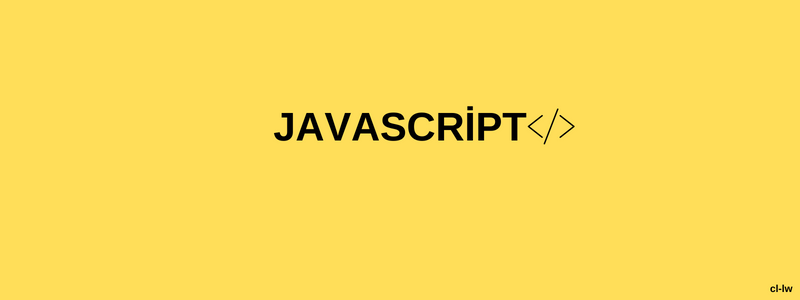

	

# JavaScript Command Sheet Guide

Imagine a guide... that explores the many possibilities for your [discord.js](https://github.com/discordjs/discord.js) bot.

## About

This guide is aimed at users who are either unfamiliar or inexperienced with Node.js and creating Discord bots. It assumes you have a basic understanding of JavaScript.

There are many different subjects covered, such as:

